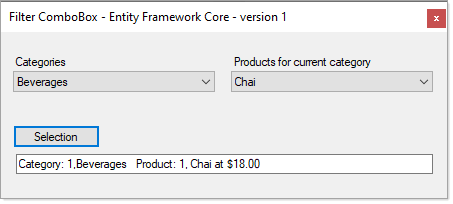

# WinForms Filter ComboBox

This article filtering a ComboBox from a parent ComboBox selection done in Entity Framework Core 3.1 or higher with a comparision to performing the same operation with DataTable containers.

Using SQL-Server database

**Microsoft TechNet article** 

[C# ComboBox to ComboBox cascade filtering DataTable verses Entity Framework Core](https://social.technet.microsoft.com/wiki/contents/articles/53760.c-combobox-to-combobox-cascade-filtering-datatable-verses-entity-framework-core.aspx)

## Notes

- Although EF Core 3.1 is used the code will work with later versions
- 08/2022 code changes, if a category has no products  
  - Data provider does not present the category
  - EF Core shows `None` for a category without products
